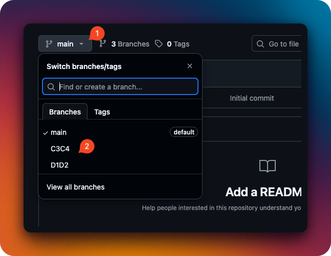
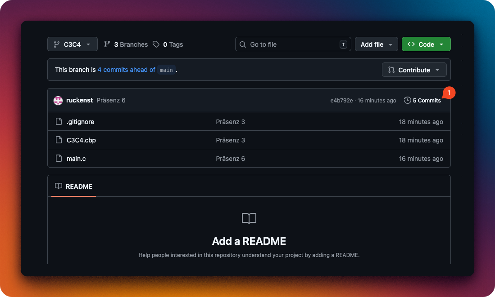
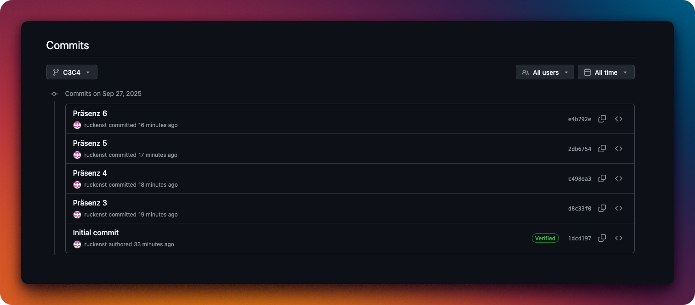

# PROZD Repository

Willkommen im Repository!

Hier findet ihr den Code, den wir gemeinsam in den Präsenz-Einheiten erarbeiten.
Damit ihr schnell das Richtige findet, folgt einfach den Schritten unten.

---

## 1. Branch eurer Gruppe auswählen

1. Öffnet die **Branch-Auswahl**.
2. Klickt auf eure **Gruppe**.
3. Fertig – ihr seht jetzt euren aktuellen Code.

---

## 2. Code herunterladen

Am besten verwendet ihr **git**. Das ist gute Übung und ihr braucht es später sowieso.

### Variante A: Mit Git (empfohlen)

Du kannst dazu auch das Cheatsheet verwenden:
[https://training.github.com/downloads/de/github-git-cheat-sheet/](https://training.github.com/downloads/de/github-git-cheat-sheet/)

Oder du nutzt **GitHub Desktop**, wenn du lieber eine grafische Oberfläche hast.

### Variante B: Ohne Git

Alternativ könnt ihr:

* das Repository als **ZIP-Datei herunterladen**, oder
* den Inhalt z. B. aus `main.cpp` kopieren.

---

## 3. Vorherige Präsenzeinheiten ansehen

1. Wählt zuerst euren **Gruppen-Branch**.
2. Klickt auf die **Git-History**.
3. Wählt den Commit der gewünschten Einheit aus.